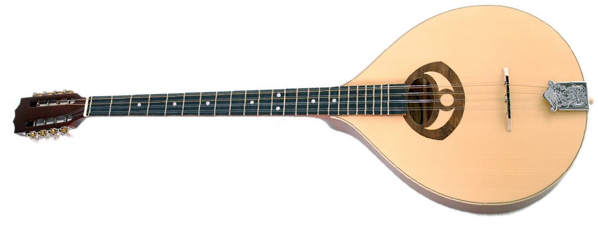

WebAudio Bouzouki: Real-time Physical Modelling
==============

In this article an implementation of a Karplus-Strong plucked string synthesiser is discussed. The synthesiser runs in real-time in modern web-browsers using a WebAudio implementation (written in Javascript). It is intended to be useful for use for procedural audio in web-based games, as the parameters are customisable. This particular implementation focuses on reporoducing the tone of a bouzouki as realistically as possible.

<figure>
	
	<figcaption>Ozark 2222 Bouzouki</figcaption>
</figure>

<figure>
	<audio controls>
		<source src="audio/sample.mp3" type="audio/mpeg" />
		Your browser does not support the audio element.
	</audio>
	<figcaption>Recording of Bouzouki</figcaption>
</figure>

Background
----------

Karplus and Strong discovered in the early 1980s that low-pass filtering a wavetable on every pass produced realistic (ish) sounding string synthesis. This is the basis for the physical modelling approach used here. 

A model of a string exists whereby a wave travels along the string. When it hits the nut or the bridge at either end, some amount of this wave is diffused (loss), and some is reflected back along the string in the other direction. This produces acoustic waves. The non-linearity of this is what produces the interesting, realistic sounds, since they are so complex it does not sound synthetic.

<figure>
	<figcaption>KS algorithm diagram here</figcaption>
</figure>

What makes a model physical is the manipulation of 'physical' properties rather than signal processing ones. I.e. we can adjust the 'length' of the string or the amount of damping it has, rather than adjusting the frequency or the waveshape directly. This is a complex system, we we expect these parameters to map in complex ways to these underlying signal processing parameters, and produce interesting outputs.

d'Alembert's used to do left/right travelling waves, this is applied by Julius Smith to create a simple and efficient formalised solution for Karplus-String. 

Signals scatter at a discontinuity when there is a change in impedance (Kelly-Lochbaum Scattering junction)

Implementation
--------------

The implementation is built on several layers:

- A one-dimensional finite differences implementation of wave equation.
- The shape of the excitation function can be adjusted (pluck position), which represents 
- Karplus-Strong losses introduced at the bridge (both a linear loss and a low-pass filter).	- Whilst it's not a physical parameter, the number of coefficients used for the non-recursive low-pass filter can be adjusted, which does dramatically change the tone. This could be said to be related to the 'damping' parameter, so should perhaps be linked directly to that.
- This is implemented 8 times for the 8 strings.
- There is an attempt to build a scattering junction into the bridge where the energy from each string can diffuse into the neigouring strings (hopefully to promote the resonant quality of the original instrument). It's arguably as to whether this naive approach was succesful.
- These parameters are tuned to sound as close to the bouzouki as possible.

- Block diagram?
- Systems, physics, etc
- Mathematics
- Predict its behaviour?
- Evidence in time/freq analysis?
- Validate the model
- Present results

Extras
------

You should then discuss any of the enhancements or additional extras you have added to expand the range of sounds your model is capable of producing. Finally, present your sound design example presets, discuss their sonic content and demonstrate what your system is capable of. Conclude your article with a complete evaluation of what you have achieved and what might be the next steps for this next-generation synthesizer

A slight variation on parameters was added. This is meant to emulate the natural playing of the instrument; every time you pluck on the real strings, there will be slightly different amounts of damping and slightly different pluck positions. These changes add to the natural sound of the synthesis.

An attempt was made to introduce coupling between the strings to develop the inter-string resonances that are characteristic of the instrument [cite][realistic]. However, it is not obvious what impact this potentially naïve implementation has without proper evaluation.

Losses
------

Originally the model used a linear factor to control the amount of losses at the bridge. The model is enhanced to use a non-recursive moving average filter. More than a small handful of coefficients would increase latency but in practice that's not a problem as the tone drops off with only a very small number of coefficients.

The coefficients does seem to have a huge impact on the tone of the resulting sound, and the difference between 1 or 2 coefficients, or 2 or 3, is quite fast. In order to get more granular control over the tone it might be helpful to use a recursive filter design where the cut-off frequency or gradient can be adjusted somewhat.

Evaluation & Further Steps
--------------------------

Further to the 'systems' approach, it would be useful to evaluate the effectiveness of the convolution approach to generate the instrument body. Would it be more effective to model the body more fully? That way things could be parameterised. In the case of this model, an IR from a Taylor acoustic guitar is being used to model the body. Sticking with the convolution approach, it was intended before to utilise an anechoic chamber to record an IR from within the body of the reference bouzouki that was used when designing the synthesiser. Unfortunately this was not managed to be organised in the constraints of time available when accounting for other projects

Tolonen etc. note that modelling tension coupling of the string to the instrument body is important for the naturalness of the synthesised tone [cite][tension]. This approach does not seem too computationally expensive to be performed in real-time, although would require the implementation of a fractional delay line (this does lend itself to the DSP-style implementation used in this synthesiser).

Colophon
--------

This system and report were written in Markdown and designed in Javascript using WebAudio, React, with live-updating word count. Please contact the author if you have interesting WebAudio projects.

References
----------

[tension]: http://citeseerx.ist.psu.edu/viewdoc/download?doi=10.1.1.205.3502&rep=rep1&type=pdf "Simulation of Plucked Strings Exhibiting Tension Modulation Driving Force (T Tolonen, C Erkut, V Välimäki, M Karjalainen)"
[realistic]: http://lib.tkk.fi/Diss/2002/isbn9512261901/article6.pdf "Methods for Modeling Realistic Playing in Acoustic Guitar Synthesis (M Laurson, C Erkut, V Välimäki, M Kuuskankare)"
